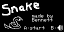

# Arduboy Snake
This is my first game developed for the [Arduboy](https://www.arduboy.com/), an open-source, 8-bit game system.
A simple game, where you eat all the fruit (circles) you can. It's game over when you eat yourself. You can pass through walls to "teleport" to the other side.

  

  

# How to play
On the start menu, press 'A' to start the game or 'B' to toggle sound.
Once the game has started use the Up, Down, Left, & Right buttons to change the direction of the snake.
Eat fruit (circles) to grow your snake. The goal of the game is to grow your snake to fit the entire screen!

# Requirements to Build
- [Arduboy2](https://github.com/MLXXXp/Arduboy2) library
